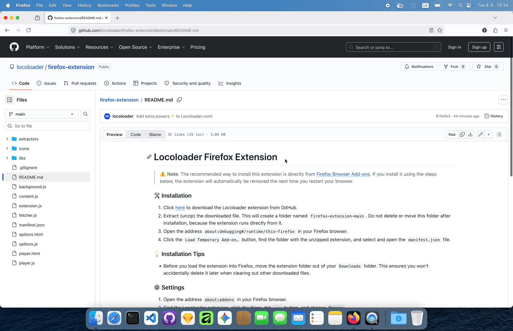

# Locoloader Firefox Extension

> ⚠️ __Note__: The recommended way to install this extension is directly from [Firefox Browser Add-ons](https://addons.mozilla.org/en-US/firefox/addon/locoloader/). If you install it using the steps below, the extension will automatically be removed the next time you restart your browser.

### 🛠️ Installation
1. Click [here](https://github.com/locoloader/firefox-extension/archive/refs/heads/main.zip) to download the Locoloader extension from GitHub.
2. Extract (unzip) the downloaded file. This will create a folder named `firefox-extension-main`. Do not delete or move this folder after installation, because the extension runs directly from it.
3. Open the address `about:debugging#/runtime/this-firefox` in your Firefox browser.
4. Click the `Load Temporary Add-on…` button, find the folder with the unzipped extension, and select and open the `manifest.json` file.

### 💡 Installation Tips
- Before you load the extension into Firefox, move the extension folder out of your `Downloads` folder. This ensures you won't accidentally delete it later when clearing out other downloaded files.

### ⚙️ Settings
1. Open the address `about:addons` in your Firefox browser.
2. Find the Locoloader extension, click the three-dot `...` button, and choose `Manage`.
3. If you use Private Windows, set `Run in Private Windows` to `Allow`.
4. Click the `Permissions and data` tab and turn on `Access your data for all websites`. Don't worry, this doesn't actually give us access to every website. Read more about how Firefox protects you [here](https://support.mozilla.org/en-US/kb/quarantined-domains).

### ⬆️ Update
1. Open the address `about:addons` in your Firefox browser.
2. Remove the Locoloader extension.
3. Follow the [installation steps](#installation).

### 🤔 Is it safe?
We made the Locoloader extension open-source so anyone can look at the code for full transparency. If you find a security bug, please let us know at [info@locoloader.com](mailto:info@locoloader.com).

### MIT License
Copyright (c) 2026 Locoloader.com

Permission is hereby granted, free of charge, to any person obtaining a copy of this software and associated documentation files (the "Software"), to deal in the Software without restriction, including without limitation the rights to use, copy, modify, merge, publish, distribute, sublicense, and/or sell copies of the Software, and to permit persons to whom the Software is furnished to do so, subject to the following conditions:

The above copyright notice and this permission notice shall be included in all copies or substantial portions of the Software.

THE SOFTWARE IS PROVIDED "AS IS", WITHOUT WARRANTY OF ANY KIND, EXPRESS OR IMPLIED, INCLUDING BUT NOT LIMITED TO THE WARRANTIES OF MERCHANTABILITY, FITNESS FOR A PARTICULAR PURPOSE AND NONINFRINGEMENT. IN NO EVENT SHALL THE AUTHORS OR COPYRIGHT HOLDERS BE LIABLE FOR ANY CLAIM, DAMAGES OR OTHER LIABILITY, WHETHER IN AN ACTION OF CONTRACT, TORT OR OTHERWISE, ARISING FROM, OUT OF OR IN CONNECTION WITH THE SOFTWARE OR THE USE OR OTHER DEALINGS IN THE SOFTWARE.